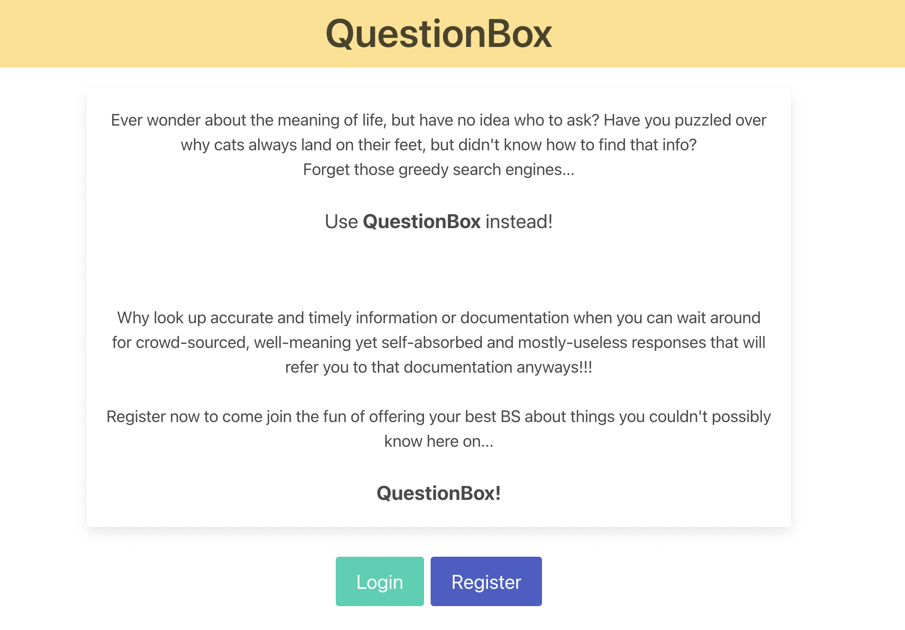
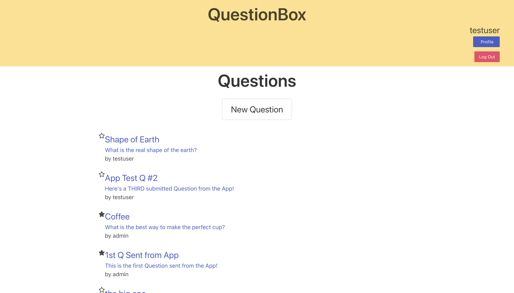

# Questionbox

This application is a question and answer platform, similar to Stack Overflow.

Current Production Model: https://polite-moxie-82b385.netlify.app

.

Link to Back End repo (by [Ryan Urbanski](https://github.com/ryanurbanski)):

https://github.com/Momentum-Team-11/questionbox-team-rocket

### Features

- New users can register for and log in and log out of accounts
- Users can view a profile page with all of their asked questions and submitted answers, as well as whether they have favorited those questions or whether those answers have been accepted as a best answer
- Users can view a list of all the questions
- Users can ask a new question
- Users can select a question to view all of its answers.
- Users can delete their own questions
- Users can create new answers
- Users can edit and delete their own questions
- Users who asked the question can double-click on the checkmark next to an answer to add it to the "Best Answers" section

#### Upcoming Features

- Users can double-click the star next to a question to add it to their favorites, which is displayed on their profile (awaiting API implimentation)
- Users can double-click a star next to an answers to add it to their favorites, which will be displayed on their profile (will add once the above is operational)
- A search function (pre-development)

### How to run locally

**QuestionBox utilizes a proprietary API as for it's database, so all that is needed to run locally is the repo and `npm install`:**

- download the zip file from [here](https://github.com/Momentum-Team-11/questionbox-team-rocket-front-end/archive/refs/heads/main.zip)
- unzip the file to your desired location
  **OR**
- clone this repo via your CLI of choice at your desired location
- navigate to the location of the unziped/cloned repo in your CLI of choice
- `cd` into that directory
- run `npm install`
- once the install is complete, run `npm run start` and the project should open up in your default browser
